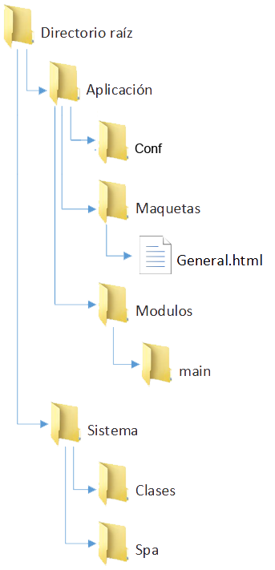

# Desarrollo de framework SPA

## Indice

<!-- MarkdownTOC -->

1. [Objetivo:](#objetivo)
1. [Introducción](#introduccion)
	1. [Configuración del framework, ultrasencilla!](#configuracion-del-framework-ultrasencilla)
	1. [Sintaxis básica](#sintaxis-basica)
		1. [Declaración de una variable](#declaracion-de-una-variable)
			1. [Declaración de atributos dinámicos](#declaracion-de-atributos-dinamicos)
	1. [El array data](#el-array-data)
	1. [Sintaxis de acceso a la información](#sintaxis-de-acceso-a-la-informacion)
	1. [Utilización de intérpretes](#utilizacion-de-interpretes)
		1. [El intérprete if](#el-interprete-if)
		1. [El intérprete forrepeater](#el-interprete-forrepeater)
		1. [El intérprete foreach](#el-interprete-foreach)
1. [Trabajando con módulos](#trabajando-con-modulos)
	1. [¿Qué son los módulos?](#que-son-los-modulos)
	1. [Creación de módulos](#creacion-de-modulos)
	1. [Vinculación de módulos](#vinculacion-de-modulos)
	1. [Desarrollo de los módulos](#desarrollo-de-los-modulos)
	1. [Ejemplo 1](#ejemplo-1)
		1. [Construcción de un sitio sencillo con galería de fotos.](#construccion-de-un-sitio-sencillo-con-galeria-de-fotos)
1. [Estructura de información](#estructura-de-informacion)
	1. [Coherencia entre cliente y servidor](#coherencia-entre-cliente-y-servidor)
1. [Componentes avanzados](#componentes-avanzados)
	1. [El router](#el-router)
		1. [Métodos públicos](#metodos-publicos)
		1. [Propiedades públicas](#propiedades-publicas)
		1. [Configurando el router](#configurando-el-router)
1. [Estructura del framework](#estructura-del-framework)
	1. [Directorio raíz](#directorio-raiz)
	1. [Directorio aplicación](#directorio-aplicacion)
	1. [Directorio sistema](#directorio-sistema)

<!-- /MarkdownTOC -->

## Objetivo:

Desarrollar un software en php y javascript que sea capaz de atender las necesidades del diseño de una web o aplicación que funcione en un navegador web y cumpla con las características necesarias de todo sitio SPA (Single Page Application). Se trabajará para ello en PHP y Javascript, con los frameworks phpQuery y jQuery respectivamente para la facilidad en el manejo de las estructuras DOM de ambas caras del software. 

El software debe ser capaz de interpretar una estructura HTML enriquecida con palabras clave que permitan desarrollar funcionalidad dentro de las mismas. Lo que se pretende de esta manera es separar completamente las actividades de presentación de la lógica del negocio. 

Para facilitar la tarea de desarrollo, todo el software estará dividido en lo que se llamarán módulos. Los mismos serán unidades más pequeñas que se encargarán de tareas específicas. Cada módulo contará con su maqueta HTML, su hoja de estilos CSS, su script Javascript y su script PHP. El framework deberá encargarse de relacionarlos y hacer funcionar todo el conjunto.


Como uno de los objetivos más importantes se debe señalar que todo el software estará orientado a ser capaz de atender tanto clientes que no cuenten con Javascript (buscadores principalmente), a los que entregará un documento HTML completamente válido, tanto como a aquellos que si tienen. A estos últimos les entregará una estructura dinámica capaz de actualizarse selectivamente dependiendo del flujo del trabajo. Esto es decir, el framework será capaz en todo momento de entender qué partes del documento se deben actualizar.

Deberá además el framework ser capaz de brindar una estructura capaz de permitir un sistema de logueo sencillo de utilizar pero potente, así como también un servicio de routeo. Para el primero se trabajará en base a categorias de usuario, numeradas todas ellas y que apuntarán a restringir mediante la simple comparación de número de categoría con número de requisito, siendo el desarrollador el que determine mediante parámetros de configuración a qué secciones o qué acciones puede realizar el usuario. El router por otro lado, tomará la ruta especificada así como la query string y la interpretará mediante reglas establecidas por el desarrollador, permitiendo tomar tantos caminos como sea necesario.
[][]
En definitiva, el objetivo de este framework será en todo momento facilitar la tarea del desarrollador, permitiendo la separación de tareas y la encapsulación de componentes. Permitirá la creación de maquetas que se encarguen de la presentación y las relacionará con sus respectivos scripts, encargados de la generación de información. Actualizará la vista del cliente siempre que se requiera y lo hará de forma dinámica, mejorando notoriamente la experiencia del usuario.

[Volver arriba](#desarrollo-de-framework-spa)

## Introducción

El presente framework brindará al desarrollador la posibilidad de desarrollar aplicaciones SPA (Single Page Application), ejecutables a través de un navegador web capaz de soportar html5 y javascript, es decir, cualquier navegador moderno. La diferencia con cualquier aplicación SPA disponible hoy en día, es que ofrecerá la posibilidad de brindar de forma sencilla, un html válido a cualquier cliente que no utilice javascript. Esto es, cuando un buscador por ejemplo entre al sitio, recibirá la misma estructura de información que lo hiciera un usuario común.

Deberíamos recordar que la principal desventaja de una aplicación SPA es que al ejecutarse, genera estructuras de información dificilmente accesibles desde un enlace estático. La solución propuesta en este framework es desarrollar la aplicación en base a una estructura modular que pueda ser accedida en todo momento desde un enlace estático y sea capaz de brindar una estructura de html válido para cualquier punto de la aplicacion, dejando el uso de javascript solamente para mejorar la experiencia del usuario.

A pesar de lo antedicho, y para beneficio del desarrollador, es necesaria la aclaración de que la utilización de la aplicación por parte del usuario, no estará destinada a simplemente cargar distintas uri estáticas, sino que manejará una estructura de información capaz de permitir al controlador del cliente la actualización selectiva de información. De esta forma la experiencia de usuario se verá enormemente beneficiada. En este aspecto, la idea del desarrollo es la de parecerse al conocido framework Angular: cuando se actualiza una variable en la estructura de la información (un nombre de usuario por ejemplo), solamente se actualiza el nodo del DOM correspondiente, dejando el resto del documento inalterado.

Cualquier persona que quisiera utilizar este framework, debería comenzar entendiendo su funcionamiento más elemental: la modularización de la aplicación. Esto es, toda la aplicación estará dividida en módulos que se encargarán de realizar tareas específicas. Quizás lo mejor sea ilustrar el uso del framework con un pequeño [ejemplo](#ejemplo-1).

[Volver arriba](#desarrollo-de-framework-spa)

### Configuración del framework, ultrasencilla!

La configuración del framework se realiza dentro del fichero **configure.php** que se encuentra en la raíz del sistema. Para ello debemos realizar las modificaciones:

Si el framework está alojado dentro de una ruta dentro de su dominio, entonces debe ser establecida en la variable **$pathPrefix**. Por ejemplo, en la siguiente declaración, el framework intentará trabajar en www.dominio.com/spaex1.

```php
// Esta variable debe ser configurada si su aplicacion se encuentra en un subdirectorio del host, ejemplo: localhost/aplicacion
// $pathPrefix = '/aplicacion';
$pathPrefix = '/spaex1/';
```

Además, se debe establecer una lista de dominios permitidos por la aplicación. Esto es un array que contenga una lista de todos los dominios que serán aceptados. Si la aplicación recibe una solicitud desde un dominio que no se encuentra en las siguiente lista, devolverá el encabezado 400: Bad request de HTTP y terminará.

```php
// Esta variable permite establecer un array de los nombres de dominios permitidos por la aplicación
$hostPermitidos = ['www.dominio.com'];
```

Con la variable $habilitarGestor se establece cuando la aplicación debe permitir el acceso al gestor de módulos o no. Ver [creador de módulos](#creación-de-módulos).

```php
// Esta variable permite establecer si el gestor estara disponible para ser utilizado, se recomienda deshabilitar esta configuracion una vez que se haya terminado de configurar el servidor.
$habilitarGestor = true;
```

**Importante:** Para que la variable $habilitarGestor surta efecto, deben cumplirse dos condiciones:

 - En el árbol de rutas, debe existir la siguiente ruta:
 
```
	"gestorFramework:gestor"
```
 	
 - En el directorio de módulos, debe existir el módulo gestor. Si se hubiera borrado accidentalmente, se puede descargar una copia [aquí](documentacion/gestor.rar).

[Volver arriba](#desarrollo-de-framework-spa)

### Sintaxis básica

Cuando recién instala el framework en su servidor, contará con una estructura similar a la siguiente: 



Si desea conocer en profundidad esta estructura, puede dirigirse a [Estructura del framework](#estructura-del-framework). Por ahora nos preocuparemos solamente por el directorio /aplicacion/modulos/main. Al entrar encontrará dos ficheros: main.html y main.php. Estos ficheros son los que definen al módulo *main*. Si Ud. entra en main.html, encontrará una estructura básica de bienvenida:

#### Declaración de una variable

```html
	<h1>{bienvenida}</h1>
```

Esta es la unidad más básica de las estructuras del framework, la inserción de variables. Cualquier cadena de texto encerrada entre llaves { y } será considerada una referencia a una variable. Para entender el funcionamiento, observemos la estructura de main.php:

```php
<?php
namespace main;

class Modulo
{
	// No modificar
	public $nombreModulo = 'Main';
	public $rutaModulo = 'main';
	public $args;

	// Array de datos que utilizara el sistema para procesar la maqueta, debe ser escrito durante la construccion del modulo
	public $data = 
	[
	];

	public function __construct($args = [])
	{
		$bienvenidas =
		[
			'Bienvenido usuario',
			'Desarrolle rápido',
			'Desarrolle bien'
		];

		// Se declara el maximo indice al que se puede acceder en el array de bienvenidas
		$maxIndice = sizeof($bienvenidas) - 1;

		// Se escoge un indice al azar
		$indiceBienvenida = floor(rand(0,$maxIndice));

		// Se escoge la bienvenida y se asigna al indice 'bienvenida' del array data del modulo
		$this->data['bienvenida'] = $bienvenidas[$indiceBienvenida];
	}
}

?>
```

Aquí hay varios conceptos involucrados, pero no nos detengamos en detalles del lenguaje por ahora. De todas formas, la estructura general del módulo será creada por el gestor de módulos. Para saber más, vea la sección [Creación de módulos](#creación-de-módulos). 

Lo que podemos decir por ahora es que la declaración del namespace, el nombre de clase, las propiedades $nombreModulo, $rutaModulo, $data y el método público \_\_construct serán generados automáticamente por el gestor. Como desarrolladores de aplicaciones dentro del framework deberíamos preocuparnos por el contenido del método \_\_construct, que será invocado por el framework cuando el módulo sea declarado. Al ser el método main, será el primero en ser invocado.

En este pequeño ejemplo, vemos que se declara un array con 3 valores, los cuales corresponden a las diferentes bienvenidas que se darán al usuario. Luego se escoge uno al azar y se asigna al **array data**. Esto es todo lo que necesitamos para crear una pantalla de bienvenida que muestre un mensaje de bienvenida al azar, escogido desde un array de mensajes.

Deberá notarse que el nombre del índice escogido en el array data es el mismo que el nombre de la variable declarada en la maqueta. De esta misma manera, podríamos también declarar atributos:

##### Declaración de atributos dinámicos

Para declarar atributos dinámicos, utilizaremos la misma sintaxis que para [declarar una variable](#declaración-de-una-variable). Encerraremos el nombre de la variable que queremos que sea utilizada por el framework entre llaves { y }. La única diferencia será que lo haremos dentro de las comillas que establecen el valor del atributo que queremos declarar:

```html
<a href='{enlaceExclusivo}' id='#{identificadorEnlaceExclusivo}'>{textoEnlaceExclusivo}</a>
```

De esta forma, si tuviésemos un array $data como el siguiente:

```php
public $data =
[
	'enlaceExclusivo' => 'http://www.sitioSuperExclusifo.com',
	'identificadorEnlaceExclusivo' => 'IdAccesibleDesdeJavascript',
	'textoEnlaceExclusivo' => 'Ir a un sitio super exclusivo'
]
```

Lograríamos un enlace válido, si luego notáramos que el valor estaba equivocado, ya que habíamos escrito 'http://www.sitioSuperExclusifo.com' en el enlace, podríamos cambiar esta propiedad desde el script php de la siguiente manera:

```php
$this->data['enlaceExclusivo'] = 'http://www.sitioSuperExclusivo.com';
```

Y el framework haría el trabajo de actualizar la información en la pantalla del cliente por nosotros.

[Volver arriba](#desarrollo-de-framework-spa)

### El array data

El array data es un array que estará presente en todos los módulos. Siempre será público y es la fuente de información que utilizará el framework para desarrollar las maquetas. Más adelante veremos que hay muchas formas de expandir la funcionalidad de la maqueta pero por ahora concentrémonos en lo básico.

En el [ejemplo anterior](#declaración-de-una-variable), vimos cómo se declaraba una variable en la maqueta, con nombre **bienvenida**. Luego, en el módulo se le asignaba un valor al array data con este mismo nombre. Este es el funcionamiento más elemental del módulo: 

	*cuando una variable es declarada en la maqueta, 
	el módulo intentará cargarla desde el array data*.

Pero esto no es todo. El array data será asociativo y multidimensional, solamente limitado por la imaginación del usuario. El framework accederá a cualquier rincon deseado del array, esto permitirá la organización estructurada de la información a mostrar por cada módulo. Para lograr este comportamiento, existe la **sintaxis abreviada de acceso a la información**. 

Imaginemos que estamos desarrollando un módulo que muestra información de un auto, entonces una estructura de información típica podría verse como la siguiente:

```php
public $data =
[
	'autos' =>
	[
		[
			'marca' => 'Chevrolet',
			'modelo' => 'Agile'
		],
		[
			'marca' => 'Volkswagen',
			'modelo' => 'Gol'
		]
	]
];
```

Entonces, esta información podría ser accedida desde la maqueta en cualquier momento. Por ejemplo, podríamos decir:

### Sintaxis de acceso a la información
```html
<div><strong>{autos/0/marca}</strong> - {autos/0/modelo}</div>
<div><strong>{autos/1/marca}</strong> - {autos/1/modelo}</div>
```

Este pequeño ejemplo funcionaría correctamente, identifiquemos pues qué elementos son los que lo hacen funcionar: Muy sencillo, la declaración de la variable está dividida en tres parte, separadas entre ellas por una barra. Cada barra indica cambio de directorio dentro del array. Es igual que acceder a una ruta de ficheros en linux. 

Entonces, en el primer div, la primera variable es **{autos/0/marca}**. El framework accederá a la variable data del módulo, leerá primero el valor de autos. Luego leerá el índice 0, que corresonde al primer auto en este caso. Y por último leerá el índice marca, que en este caso es 'Chevrolet'. Siguiendo este mismo razonamiento, podremos entender qué valores mostrarán las demás variables e imaginar que se mostrará un div para el primer auto y otro para el segundo. 

Esta es la forma más sencilla de utilizar la información de los módulos, pero obviamente es muy limitada también. Es por eso que existen otras formas de hacerlo, que permitirán mejorar notablemente la funcionalidad de nuestras maquetas.

[Volver arriba](#desarrollo-de-framework-spa)

### Utilización de intérpretes

Los intérpretes son fracciones de código destinadas a extender la funcionalidad del framework. Cada uno de ellos cumplirá con una función distinta y podrán ser declarados dentro de la maqueta para utilizarlos. Existen algunos intérpretes sencillos y otros más complejos. 

La estructura básica para usar cualquier intérprete dentro de una maqueta es la siguiente:

```html
<div nombreInterprete='nombreVariable'>Declaracion del intérprete</div>
```

Como se puede observar, existen al menos tres elementos involucrados. El *nombre del intérprete* será exresado como un atributo del elemento que lo contendrá. La información que utilizará, es decir, la variable que utilizará el intérprete será expresada como el valor de dicho atributo, especificando el *nombre de la variable*. De esta forma, cuando el framework procese esta declaración, le pasará la información al intérprete para que la desarrolle. El tercer elemento involucrado es la *declaración del intérprete*. Ésta será la guía que el intérprete utilizará para entender qué es lo que el usuario espera que haga con la información proporcionada.

**Importante:**

Si bien la sintaxis es similar a la de la declaración de atributos dinámicos, debemos notar que el nombre de la variable que queremos relacionar, **se escribe sin llaves**. Esto es muy importante ya que de otra forma se obtendrán resultados imprevistos.

Para comenzar a entenderlos, explicaremos el uso del más sencillo de todos: **el intérprete if**.

[Volver arriba](#desarrollo-de-framework-spa)

#### El intérprete if

El intérprete if es una representación de la estructura if típica en cualquier lenguaje de programación. La gran diferencia es que éste no evalúa una expresión, como generalmente lo hacen los lenguajes, sino que solamente evalua una variable. Veámoslo con un ejemplo. Imaginemos que queremos mostrar un mensaje o no al usuario, dependiendo de si éste ha iniciado sesion. Para ello, estableceríamos la siguiente declaración en la maqueta:

```html
<h2 if='nombreUsuario'>Bienvenido {nombreUsuario}.
	<else>Por favor, inicie sesión.</else></h2>
```

Cuando llenemos la información del módulo, deberíamos realizar una operación similar a la siguiente:

```php
public function __construct($args = [])
{
	// Se comprueba la existencia de nombre de usuario registrado en la sesion
	if(isset($_SESSION['nombreUsuario']))

		// Si existe, se asigna al indice nombreUsuario del array data/
		$this->data['nombreUsuario'] = $_SESSION['nombreUsuario'];
}
```

Con este código, obtendríamos un mensaje que se muestra al cliente dentro de un h2, saludando al usuario o invitando a que inicie sesión.

Otro aspecto importante de esta declaración, es la introducción de la sentencia **else**. Ésta especifica qué debe mostrarse en caso de que se evalúe como false la variable que se especificó en la declaración del intérprete, en este caso, una invitación a iniciar sesión.

La variable indicada en la especificación del intérprete, será falsa si se cumple alguna de las siguientes condiciones:

 - La variable no existe.
 - La variable fue establecida en *false*.
 - La variable tiene valor 0.

[Volver arriba](#desarrollo-de-framework-spa)

#### El intérprete forrepeater

Otro aspecto muy importante de los intérpretes, es la capacidad de generar estructuras repetitivas. El intérprete **forrepeater** recorrerá la variable especificada en el llamado al intérprete y generará una estructura de repeticiones basándose en la declaración del mismo. 

Este repetidor nos vendría muy bien para por ejemplo, escribir una lista de datos sencillos. Por ejemplo, los resultados de un sorteo:

```html
<h1>Resultados del sorteo:</h1>
<div forrepeater='resultados'>{index} - <strong>{resultados}</strong><br /></div>
```

```php
public function __construct($args = [])
{
	// Establecemos la cantidad máxima de resultados que queremos obtener
	$cantidadResultados = 25;

	// Creamos un array vacio para contener los resultados
	$resultados = [];

	// Generamos un bucle para lograr los resultados deseados
	for($i = 0; $i<$cantidadResultados; $i++)
	{
		do
		{
			// Creamos un nuevo valor
			$nuevoResultado = rand(1,100);
		} 
		// Si el valor ya esta en la lista de resultados, lo generamos nuevamente
		while(!in_array($nuevoResultado, $resultados));

		// Agregamos el nuevo resultado a la lista
		$resultados[] = $nuevoResultado;
	}

	// Establecemos el array de resultados en el array data para que pueda ser accedido por el framework
	$this->data['resultados'] = $resultados;
}
```

Debemos notar que el esquema de trabajo se mantiene: generamos los datos en el módulo, el framework los muestra en la maqueta por nosotros. De esta forma, siempre tenemos una maqueta limpia, libre de programación y al contrario, nuestro código siempre está limpio de html.

El intérprete forrepeater lo que hace en esta situación, es tomar cada valor del array que le hayamos pasado como parámetro. Luego toma la declaración establecida y reemplaza las cadenas **{index}** por el índice actual del bucle y la cadena **{nombreVariable}** por el valor actual en el bucle. En este caso, el nombre de la variable es resultados, por ese motivo podemos encontrar la cadena **{resultados}** en el cuerpo de la declaración.

En el ejemplo anterior, creamos un array con 25 valores aleatorios y los asignamos al índice resultados del **array data**. Por otro lado en la maqueta, incrustamos un intérprete de tipo forrepeater y le pasamos como parámetro justamente la variable resultados. Además establecimos una estructura para que la repita por cada valor, mostrando el índice y el valor de la misma.

Con este proceso logramos una página que muestra los resultados, separados por un <br />, que fue el que colocamos al final de la declaración del intérprete. Cada resultado vendrá acompañado por la posición que ocupan dentro del sorteo.

Si bien con esto logramos añadir un poco más de funcionalidad a nuestra maqueta, ésta todavía se encuentra limitada. Porque, ¿qué pasaría con un ejemplo como el de los autos? Para eso existe el siguiente intérprete.

[Volver arriba](#desarrollo-de-framework-spa)

#### El intérprete foreach

El intérprete foreach es el segundo de los repetidores. Su función es generar una estructura repetitiva, permitiendo el acceso a las diferentes propiedades de los objetos que queremos repetir. Retomemos el ejemplo de los autos para entenderlo:

```php
public $data =
[
	'autos' =>
	[
		[
			'marca' => 'Chevrolet',
			'modelo' => 'Agile'
		],
		[
			'marca' => 'Volkswagen',
			'modelo' => 'Gol'
		]
	]
];
```

Con esta estructura, obviamente estamos buscando mostrar al usuario la marca y el modelo de una lista de autos que tenemos en el array de data. Para ello, usaremos la siguiente declaracion:

```html
<ul foreach='autos'>
	<li><strong>{autos.marca}</strong> {autos.modelo}</li>
</ul>
```
Con solo esta sentencia, nosotros nos aseguramos de que el framework listará todos los autos que se encuentren en la lista. No importa cuántos sean. Ahora, sobre la declaración, podemos observar que hay una leve diferencia en la sintaxis con respecto a la [sintaxis de acceso a la información](#sintaxis-de-acceso-a-la-información) que habíamos mencionado previamente.

Esto es así porque el intérprete foreach define una sintaxis propia. Esta es: {nombreVariable.nombrePropiedad}, siendo nombreVariable el nombre de la variable que se pasó como parámetro al intérprete. Si nos fijamos, la variable pasada fue **autos** y las propiedades fueron **marca** y **modelo**. Esto se corresponde con el array de datos establecido.

Existen dos intérpretes más establecidos por defecto, pero no los trabajaremos por el momento debido a su complejidad mayor. Primero, debemos ver de qué manera podemos incrustar módulos dentro de la maqueta.

[Volver arriba](#desarrollo-de-framework-spa)

## Trabajando con módulos

### ¿Qué son los módulos?

Los módulos son la unidad más básica de producción de información del framework. Toda la aplicación desarrollada se sustentará en estas unidades y siendo bien entendidas, permitirán la organización de la estructura de la misma de forma ordenada y accesible. El objetivo de esta división será siempre la facilidad del desarrollo, mantenimiento y evolución de la aplicación creada.

Cada módulo tendrá su propio directorio dentro del directorio de módulos, que por defecto es **/aplicacion/modulos**. El módulo principal de la aplicación es por defecto el módulo **main**. A través de él se accederá a todo el resto de la estructura, será el punto de partida. 

A medida que desarrollemos nuestra aplicación, iremos creando distintos módulos que se enlazarán entre sí de forma selectiva, permitiendo generar una estructura dinámica basada en el entorno sin ningún tipo de restricción.

La estructura funcional del módulo estará dividida en cuatro partes, expresadas a través de ficheros contenidos por el directorio del módulo: 

 - **La unidad de maquetación (.html):** Es un fichero html con el nombre del módulo, en él se expresa la sintaxis html enriquecida que el framework interpretará y desarrollará para crear la aplicacion, basándose en la información que nosotros le proveamos.
 - **La unidad de edición (.php):** Es un fichero php con el nombre del módulo, en él se expresa un script encargado de generar la información necesaria para que el módulo trabaje correctamente. Su estructura se basa en la declaración de una clase llamada Modulo, que deberá trabajar dentro de un namespace igual a la ruta de acceso al módulo. Además contendrá un [array público llamado $data](#el-array-data) que permitirá informar al framework sobre todas las características que deseemos hacer públicas del módulo y que probablemente queramos que el framework interprete y desarrolle en nuestra maqueta. 
 
 	Tendrá además, un método **__constructor** público que respetará la siguiente declaración:

```php

	public function __constructor($arts = []) {} : void

```

 - **La unidad de estilos (.css):** Es un fichero css con el nombre del módulo, en él se expresa la declaración de los estilos del módulo. Existe una sintaxis específica para los estilos que puede ser consultada en la sección estilos de los módulos.
 - **La unidad de controlador (.js):** Es un fichero js con el nombre del módulo, en él se expresa la declaración del script del controlador, escrito en javascript. **No está implementado todavía.** Su función en el futuro será la de proveer funcionalidad específica del módulo al lado del cliente, relacionada con su información y con su estructura.

Si bien a primera vista puede parecer que la estructura es demasiado compleja, esto no debe preocuparnos en la medida que será generada automáticamente por el gestor de módulos integrado en el framework.

[Volver arriba](#desarrollo-de-framework-spa)

### Creación de módulos

El framework trae incorporado un creador de módulos que puede ser accedido a través del URI www.tudominio.com/gestor. La única forma de acceder a él es [configurando](#desarrollo-de-framework-spa) el framework para que acepte mostrar el gestor. Utilizándolo, nos evitamos la molestia de tener que generar manualmente la estructura del módulo, que si bien no es demasiado compleja, puede resultar tedioso hacerlo cada vez que queremos crear uno nuevo.

Si la configuración está bien realizada, se debería poder tipear en el navegador: www.tudominio.com/raizDelFramework/gestor y saldría una pantalla como la siguiente:

	**Importante:** El módulo gestor será parte del directorio de módulos. 
	Sólamente funcionará la actual configuración si éste no fue eliminado.


La creación de módulos en el presente framework, se hará a través de la especificación de la ruta del módulo. Para ello, se debe ingresar en el campo nombre de módulo la ruta del módulo que desee crear. Esta ruta es la misma que será accedida para incrustar el módulo en otra maqueta y deberá respetar la [sintaxis de acceso a la información](#sintaxis-de-acceso-a-la-información).

Para entender el por qué de esta sintaxis, debemos entender que los módulos serán hijos de otros módulos en la ejecución, a través de las declaraciones realizadas en las diferentes maquetas. Pero también serán hijos de otros modulos en la declaración, a través de la creación de módulos dentro del directorio de otros módulos. Esto es así para facilitar la organización de la información.

Por ejemplo, nosotros podríamos tener un directorio dentro de la raíz de módulos llamado usuarios, y dentro de él tener declarados dos módulos llamados **informacion** y **modificar**. Cada uno de ellos cumplirá una función distinta, pero los dos estarán agrupados dentro de usuarios, permitiendo identificar sobre qué área de la aplicación trabajan.

Para crear estos módulos, deberíamos escribir en el campo de nombre de módulo:

	usuarios/informacion
	usuarios/modificar

Cada línea del anterior bloque es una entrada distinta en el campo, o sea, debemos escribirlas por separado y presionar enter. Una vez creados ambos módulos, podremos acceder a ellos desde el directorio de módulos, dentro del directorio usuarios. Allí encontraremos a su vez, dos directorios: informacion y modificar.

Esta declaracion, además de generar los directorios y las estructuras correspondientes para el módulo, define la que se pasará a llamar **Clase del módulo**. Esto es así y permite que distintos módulos compartan el nombre. Por ejemplo, uno podría tener dos módulos distintos, con clase usuarios/informacion y autos/informacion. El nombre de ambos módulos sería información pero la clase no. Y esto es lo que permite instanciarlos.

Esta estructura se podrá extender tanto como el desarrollador desee, por ejemplo, podemos generar dos módulos distintos para mostra la información del usuario: la información de los usuarios estándar y la información de los administradores. En ese caso, en vez de las dos líneas anteriore, hubiésemos utilizado estas tres:

	usuarios/informacion/estandar
	usuarios/informacion/administrador
	usuarios/modificar

Esto hubiera generado la misma estructura de informacion que el bloque anterior, con la diferencia que dentro del directorio usuarios/informacion hubiese generado dos directorios: estandar y administrador. Así podríamos hacer lo mismo para el módulo usuarios/modificar, o para el módulo usuarios/informacion/estandar, creando submódulos a partir de ellos. Esto es, la estructura de módulos estará limitada solamente por la imaginación del usuario.

[Volver arriba](#desarrollo-de-framework-spa)

### Vinculación de módulos

La creación de módulos no tendría ningún sentido si no pudiesen ser vinculados. La vinculación entre ellos es la forma en la que la estructura toma sentido y también la forma en que se logra generar estructuras dinámicas en cualquier dimension.

Para vincular un módulo a otro, basta con declararlo de la siguiente manera:

```html
<div modulo='claseModulo' />
```

De esta forma, el framework cargará el módulo especificado, interpretará su información, a partir de la cual desarrollará su maqueta y lo insertará dentro del elemento que contiene el atributo modulo. La sintaxis para declarar el nombre de un módulo, al igual que en la creación del mismo, respeta la [sintaxis de acceso a la información](#sintaxis-de-acceso-a-la-información). De esta forma uno podría, siguiendo el ejemplo anterior, instanciar el módulo para mostrar la información de un usuario estándar de la siguiente manera:

```html
<div modulo='usuarios/informacion/estandar' />
```

El framework tomaría esta declaración y cargaría un módulo de clase usuarios/informacion/estandar, lo desarrollaría y lo insertaría dentro del div. Pero esto no tendría mucho sentido si no se pudiese pasar información al modulo. Es decir, ¿habría que crear variables globales? **ABSOLUTAMENTE NO**.

Cuando se instancia un modulo, el framework tomará todos los atributos adicionales como parámetros para el mismo. Estos parámetros deberán hacer referencia a índices del [array data](#el-array-data). Ya fuese a índices que se encontraran en su raíz, o a índices que se encontraran más adentro. Incluso estos índices podrían ser creados a partir de un repetidor.

Imaginemos que queremos crear un menú de navegación, crearemos un módulo de clase *navegacion* y un módulo de clase *navegacion/boton*. Estableceremos el array data del módulo navegación de la siguiente manera:

```php
public $data =
[
	'opciones' =>
	[
		['href' => '{uri/base}/Inicio', 'title' => 'Ir al inicio', 'text' => 'Inicio'],
		['href' => '{uri/base}/About', 'title' => 'Saber más sobre nosotros.', 'text' => 'Nosotros'],
		['href' => '{uri/base}/Contacto', 'title' => 'Opciones de contacto', 'text' => 'Contacto'],
	]
];
```

Luego la maqueta del módulo **navegacion**:

```html
<ul forrepeater='opciones'>
	<li modulo='navegacion/boton' options='opciones/{index}' />
</ul>
```

Esto puede parecer confuso, pero se puede aclarar fácilmente tomando en cuenta el método de [desarrollo de los módulos](desarrollo-de-los-módulos). Como adelanto, el repetidor se ejecuta primero, desarrolla una sentencia de tipo li por cada índice del array opciones y la escribe en la maqueta. Para cuando el repetidor termina de trabajar, el módulo contiene la siguiente estructura:

```html
<ul>
	<li modulo='navegacion/boton' options='opciones/0' />
	<li modulo='navegacion/boton' options='opciones/1' />
	<li modulo='navegacion/boton' options='opciones/2' />
</ul>
```

Esto le indicaría al framework que tiene que instanciar tres módulos de la clase navegacion/boton y pasarle a cada uno de ellos el array contenido dentro de cada índice del array opciones. Si tuviésemos declarado el módulo navegacion/boton de la siguiente manera:

```php
public function __contruct($args)
{
	$this->data = $args['options'];
}
```

En el constructor, el parámetro $args recibido por el módulo declarado con el índice 0 será:

```php
$args = 
[
	'href' => '{uri/base}/Inicio', 
	'title' => 'Ir al inicio', 
	'text' => 'Inicio'
]
```
Como lo habíamos asignado al array data, podríamos acceder a estos datos desde la maqueta, de la siguiente manera:

```html
<a href='{href}' title='{title}'>{text}</a>
```

Lograríamos un menú de navegación basado en listas completamente funcional. Si además consideramos la posibilidad de aplicar estilos por separado a cada módulo, veríamos qué fácil sería dejarlo super presentable.

[Volver arriba](#desarrollo-de-framework-spa)

### Desarrollo de los módulos

El desarrollo de los módulos sigue un orden específico que permite definir reglas claras a la hora de escribir una maqueta compleja:

1. **Se desarrolla la maqueta:** El proceso de desarrollo de la maqueta consiste en ubicar todos los intérpretes declarados y procesarlos. De esta forma, los repetidores desarrollan las sentencias correspondientes, el if decide qué datos van a estar presentes y cuáles no. 
	
	El proceso de desarrollo realiza la búsqueda de intérpretes en forma descendente en el DOM. De esta
forma se asegura que aquellos que sean declarados en un nivel superior se ejecuten primero, manteniendo una coherencia con las declaraciones.

2. **Se interpretan las variables:** Luego se buscan todas las variables dentro de la maqueta y se reemplazan por sus valores correspondientes. Es importante notar que solamente se podrán escribir en la maqueta variables que puedan ser transformadas a string. Si se declara una variable cuyo valor no puede ser transformado a string, resultará en un error. 
	
	Por otro lado, las variables que se declaren en la maqueta pero no puedan ser ubicadas en el módulo, serán buscadas también en la configuración, de esta forma tenemos la posibilidad de incrustar valores de la configuración en la maqueta.

3. **Se incrustan los módulos:** Una vez que todas las variables fueron interpretadas, se llama a los módulos correspondientes, los que hayan quedado declarados en la maqueta luego de los procesos anteriores y se los declara como hijos del módulo actual. Estos a su vez serán desarrollados de la misma forma que se explicó en este apartado generando una estructura de árbol entre módulos e hijos.


[Volver arriba](#desarrollo-de-framework-spa)

### Ejemplo 1
#### Construcción de un sitio sencillo con galería de fotos.

Imaginemos un sitio web bien elemental en donde se quiere mostrar una bienvenida, una sección de contacto y una galería sencilla, en donde solamente se mostraría un cuadro por cada foto, y cada foto a su vez es cliqueable para acceder al fichero de la misma.

La estructura ya terminada del documento, puede ser accedida haciendo clic [Aquí](documentacion/ejemplo1.rar)

Una vez que tengamos instalado y [configurado](#configuración-del-framework-ultrasencilla) nuestro framework, podríamos simplemente descomprimir el [fichero rar](documentacion/ejemplo1.rar) del ejemplo dentro del directorio de módulos o crear los archivos con el contenido especificado a continuación.

Para una estructura de este tipo, el desarrollador tendría que generar un árbol de información similar al siguiente:


Una vez desarrollado el contenido de los distintos ficheros, deberíamos obtener un sitio similar al siguiente:


El contenido de cada fichero es detallado a continuación, si bien puede parecer compleja la estructura sobre todo de los ficheros php, créeme que no lo es. Sobre todo considerando que el framework incorpora su propio [creador de módulos](#creación-de-módulos).

<a id="estiloscss"></a>
###### estilos.css

Dentro del archivo rar del ejemplo se encuentra **estilos.css**, el cual debería ser copiado en la raíz del framework para poder obtener el ejemplo con todos los estilos. Su contenido no se copia aquí por ser demasiado extenso y ocupar espacio innecesariamente.

<a id="headerhtml"></a>
###### header.html

```html
<h1>Sitio de fotos</h1>
```

<a id="mainhtml"></a>
###### main.html

```html
<header modulo='header' />
<nav modulo='navegacion' options='menuPrincipal' />
<main modulo='paginas/{pagina}' />
```

[Volver arriba](#desarrollo-de-framework-spa)

<a id="mainphp"></a>
###### main.php

```php
<?php
namespace main;

class Modulo
{
	// No modificar
	public $nombreModulo = 'Main';
	public $rutaModulo = 'main';
	public $args;

	// Array de datos que utilizara el sistema para procesar la maqueta, debe ser escrito durante la construccion del modulo
	public $data = 
	[
		'menuPrincipal' =>
		[
			['link' => '{uri/base}/inicio', 'title' => 'Ir al inicio', 'text' => 'Inicio'],
			['link' => '{uri/base}/galeria', 'title' => 'Galeria de fotos', 'text' => 'Galeria'],
			['link' => '{uri/base}/contacto', 'title' => 'Medios de contacto', 'text' => 'Contacto']
		]
	];

	public function __construct($args = [])
	{
		$pagina = \Router::get('pagina');
		$this->data['pagina'] = $pagina ? $pagina : 'inicio';

		\Conf::set('tituloPagina','Framework SPA');
		\Conf::set('sloganPagina','Super sencillo');
		\Conf::set('keywordsPagina','framework, web design, development, javascript, php, css');
		\Conf::set('descripcionPagina','Este framework pretende facilitar el desarrollo de aplicaciones SPA accesibles sin javascript.');
	}
}

?>
```

<a id="navegacionhtml"></a>
###### navegacion.html

```html
<ul foreach='menu'>
	<li><a href='{menu.link}' title='{menu.title}'>{menu.text}</a></li>
</ul>
```

<a id="navegacionphp"></a>
###### navegacion.php

```php
<?php
namespace navegacion;

class Modulo
{
	// No modificar
	public $nombreModulo = 'Navegacion';
	public $rutaModulo = 'navegacion';

	// Array de datos que utilizara el sistema para procesar la maqueta, debe ser escrito durante la construccion del modulo
	public $data = [];

	public function __construct($args)
	{
		$this->data['menu'] = $args['options'];
	}
}

?>
```

<a id="contactohtml"></a>
###### contacto.html

```html
<ul foreach='datos'>
	<li><strong>{index}:</strong> {value}</li>
</ul>
```

<a id="contactophp"></a>
###### contacto.php

```php
<?php
namespace paginas\contacto;

class Modulo
{
	// No modificar
	public $nombreModulo = 'Contacto';
	public $rutaModulo = 'paginas/contacto';

	// Array de datos que utilizara el sistema para procesar la maqueta, debe ser escrito durante la construccion del modulo
	public $data = 
	[
		'datos' =>
		[
			'Telefono' => '2202 2202',
			'Email' => 'contacto@bestfotos.com.uy',
			'Direccion' => 'L. Alberto de Herrera 2202'
		]
	];

	public function __construct($args)
	{
	}
}

?>
```

[Volver arriba](#desarrollo-de-framework-spa)

<a id="galeriahtml"></a>
###### galeria.html

```html
<div id='VistaPrevia' if='imagenGrande'>
	<a href='{imagenGrande}' title='Abrir imagen' target='_blank'>
</div>
<div forrepeater='fotos'>
	<div class='MarcoFoto'><a href='{uri/base}/galeria/{index}' title='Abrir imagen'></a></div>
</div>
```

<a id="galeriaphp"></a>
###### galeria.php

```php
<?php
namespace paginas\galeria;

class Modulo
{
	// No modificar
	public $nombreModulo = 'Galeria';
	public $rutaModulo = 'paginas/galeria';

	// Array de datos que utilizara el sistema para procesar la maqueta, debe ser escrito durante la construccion del modulo
	public $data = [];

	public function __construct($args)
	{
		$this->data['fotos'] = array_values(array_map(function($el)
		{
			return conf('uri/base') . "/aplicacion/spaex1/modulos/paginas/galeria/pictures/$el";
		},array_filter(scandir(__DIR__ . '/pictures'),function($el)
		{
			return !in_array($el, ['..','.']);
		})));

		if(\Router::get('imagen') !== null)
			$this->data['imagenGrande'] = $this->data['fotos'][\Router::get('imagen')];
	}
}

?>
```

<a id="iniciohtml"></a>
###### inicio.html

```html
<h2>Bienvenidos a mi sitio de fotos</h2>
<p>Por favor, visite la galeria.</p>
```

[Volver arriba](#desarrollo-de-framework-spa)

## Estructura de información

Todo el framework se basa en una estructura de información representada por un árbol de módulos. Ya en la introducción hablamos sobre el módulo main, que sería la raíz del árbol a partir del cual se generan los demás y cómo a su vez éstos podían vincular otros. Siguiendo esta línea de razonamiento podríamos imaginar que la forma del árbol solamente depende de la forma de la aplicación y cómo éstas están estrechamente relacionadas. 

De acuerdo a esto el servidor siempre guarda la información del árbol que se entregó al cliente por última vez. Cada vez que recibe una petición de parte de él, realiza el desarrollo de un nuevo árbol de acuerdo a esta petición y lo compara con ya entregado. En esta comparación realiza una lista de diferencias y una vez encontradas, busca qué módulos son necesarios para poder a partir de esta información volver a construir todo el árbol. De estos módulos que encuentra busca cuáles ya fueron entregados al cliente y hace una lista de los que no, carga sus maquetas y las agrega a la estructura. De esta forma la respuesta del servidor es siempre una estructura que contiene los módulos faltantes en el lado del cliente y las diferencias en el árbol de información que el cliente debe procesar para poder actualizar la pantalla.

Aquí está el diagrama de la estructura de la respuesta: 


### Coherencia entre cliente y servidor

Esta estructura es la que realmente permite la coherencia entre ambos y para lograrlo hay algunos detalles importantes. Al no saber realmente en cada petición si el cliente ejecutará javascript o no, opté por retrasar la ejecución del módulo spa hasta que el mismo lo confirme. Para ello, en la primera petición que realiza un usuario a la aplicación (es decir, que carga una página), recibe además de la estructura de html válida una **semilla SPA**. Esto es, un pequeño fragmento de código que se ejecutará una vez que la página esté cargada avisando al servidor de que el módulo SPA puede ser ejecutado. En este momento el servidor hace entrega de la primera estructura de información, junto con los módulos que sean necesarios para su construcción.


Una vez hecho esto, el cliente tendrá todas las herramientas para ejecutar el módulo SPA y así lo hará. A partir de la estructura recibida, reconstruirá el árbol de información presente en el servidor y desarrollará todos los módulos de la misma forma que lo hizo el servidor. Es decir, el cliente recorrerá el camino contrario a éste. Mientras el servidor lee los módulos, guarda el árbol de información y entrega al cliente la estructura representativa; el segundo recibe la estructura, la convierte en árbol y a partir de allí construye los módulos.

Terminada la re-composición del árbol de módulos, se reemplaza el contenido del DOM en el navegador por el DOM dinámico generado por el módulo SPA. Siendo cierto que la primera carga es ligeramente más pesada que una carga común (no se puede afirmar que sea el doble, **ni mucho menos** ya que lo único que se carga dos veces es la información referente al DOM, no las imágenes ni estilos), esto permite una una experiencia de usuario fantástica ya que una vez que el módulo SPA esté activo, todas las cargas serán selectivas y dinámicas, dotando a la aplicación de un flujo muy agradable. 

Para lograr esto, el módulo SPA intervendrá todas las peticiones que el usuario realice, ya sea mediante click en los enlaces o mediante submit en los formularios, solamente si éstos se refieren al dominio sobre el que está trabajando la aplicación (no se intervendrán enlaces externos) y si estos no tienen el atributo target='\_blank'. Realizará todas las peticiones de forma asíncrona mediante Ajax, agregando el query string '?spa' en la ruta de solicitud, informando de esta forma al servidor que el módulo SPA es quien realmente hace la llamada.

El servidor sabiendo esto, utilizará la información que tiene guardada del volcado anterior, desarrollará la nueva ruta a la que el usuario desea acceder y encontrará todas las diferencias, volcando al cliente la estructura de **diferencias** y los módulos que éste aún no tenga para reconstruir las partes que difieran del árbol mantiene actualmente.


[Volver arriba](#desarrollo-de-framework-spa)

## Componentes avanzados

El framework incluye algunas funcionalidades más complejas que nos facilitan tareas muy importantes a la hora de crear una aplicación. Las más destacables son:

 - **Router:** El router es el encargado de desglosar las rutas recibidas y disponer de dicha información para ser utilizada por otros componentes. Será el primer componente que actúe en el sistema ya que a partir de éste se desarrollarán las demás actividades. La forma en que compartirá la información será a través de métodos y propiedades públicas que podrán ser accedidas desde los demás componentes en todo momento. Además permitirá el cambio de ruta por parte de los otros componentes, esto será una ventaja especialmente en el proceso de logueo.

 	Su principal funcionalidad es la de permitir el uso de URL's amigables tanto para el cliente y los buscadores como para los desarrolladores. Me refiero a esto particularmente porque muchas veces a la hora de desarrollar un sitio, el problema de generar URL amigables para toda la aplicación se vuelve complejo y tedioso. Este componente busca que esto resulte sencillo mediante la utilización de una hoja de rutas fácilmente configurable.

 - **Identificador:** El identificador maneja una estructura de identificación de usuario robusta que permite restringir de forma selectiva cualquier sector de la aplicación. Para ello admite la generación de reglas que se corresponden con las propiedades obtenidas en el proceso de routeo. De esta forma, podemos restringir cierta sección de la aplicación, alguna acción dentro de ésta o cualquier otra cosa que se nos ocurra en base a niveles de acceso.

 - **Otros intérpretes:** El framework cuenta por el momento con dos intérpretes más además de los ya mensionados. Éstos son el **modulerepeater** y el **tablemaker**. El primero se utilizará en algunas situaciones particulares, en donde la estructura del forrepeater o del foreach pudieran complicar las cosas. El segundo toma un array de datos y lo convierte automáticamente en una tabla.

### El router

El router está inspirado en el modelo ofrecido en el libro **PHP MASTER: Write cutting-edge code** de Lorna Mitchell, Davey Shafik y Matthew Turland, sobre todo en la parte de interpretación de la hoja de rutas. Su objetivo es facilitar al desarrollador la construcción de una aplicación basada en rutas amigables, sin la necesidad de lidiar con la interpretación de las mismas. Para ello ofrece la posibilidad de editar un archivo de rutas que mantiene un formato similar al del libro mencionado. El api del Router es:

#### Métodos públicos

- run(): Método que ejecuta los procesos necesarios para el correcto funcionamiento del router, derivando en la interpretación de la ruta actual del sistema y la creación de los distintos array de propiedades públicas.

- redirect(ruta): Método que siendo invocado antes del proceso de maquetación, permite redireccionar el flujo de la aplicación hacia una ruta distinta a la solicitada por el usuario. Fue pensado inicialmente para permitir redireccionar al usuario al sitio de ingreso de credenciales cuando fuese necesario. Podría ampliarse su funcionamiento para permitir la redirección de la aplicación luego de comenzado el proceso de maquetación, permitiendo que los módulos decidan también el flujo de la aplicación. 

- get(propiedad): La gran ventaja del router es que permite asociar las rutas con propiedades bien definidas que adoptan el valor establecido en las mismas. Mediante una estructura de comparación que es la que el desarrollador define en la hoja de rutas, el router establece un array de propiedades nombradas con sus valores correspondientes según la ruta actual. Con el método get, podemos obtener estos valores o null en caso de que las propiedades no estén definidas.

- current(): Devuelve la ruta actual en la que se encuentra el router.

#### Propiedades públicas

- $arrayRuta: es un array que contiene en la clave 0 el dominio actual y en cada siguiente elemento un directorio mas de la ruta.
- $rutaActual: es un array asociativo que contiene el resultado del procesamiento de las rutas descritas en el fichero rutas.json.
- $rutasProcesadas: es un array que contiene el historial de rutas que ha procesado el router en esta oportunidad.

#### Configurando el router

El router se configurará modificando el contenido de la hoja de rutas que se encuentra en el directorio /aplicacion/conf. Siendo que las rutas se basan en una estructura de directorios, el router también lo hará. Este fichero es un archivo json y el formato en que se modifique debe respetar las reglas del dicho formato. Para ser más claros, el fichero debe tener un formato idéntico al siguiente:

```json
[
	"ruta1",
	"ruta2",
	"ruta3"
]
```

**Si hubiese algún defecto en dicho formato, el router no podría funcionar.**

El router siempre contrastará con la cadena de caracteres que siguen al dominio y ruta de la aplicación. Es decir, si la aplicación se encuentra dentro del dominio y rutas www.dominio.com/ruta, cuando el usuario acceda a la uri www.dominio.com/ruta/pagina/accion/item, el router contrastará las rutas con pagina/accion/item y devolverá el resultado más acertado. Además, procesará las rutas directorio por directorio, es decir, que las mismas se compondrán de distintas instrucciones separadas por una /. Y cada directorio mantiene una de las siguientes estructuras:

- **cadena**: Es una cadena de caracteres que no representa ninguna variable y no es representada en el router. Si se ingresa este tipo de directorio, el router solamente busca si existe coincidencia con la ruta recibida pero no genera ningún tipo de información a partir de ella.

- **variable:cadena**: Este tipo de instrucción, indica al router que en este directorio debe existir una cadena específica. Es utilizado cuando varias rutas coinciden en formato para diferenciarlas, ya que el router siempre dará prioridad a las rutas específicas por sobre las genéricas.

- **variable:TIPO:** TIPO es una de las constantes definidas por el router: 
 
	- **ALPHA:** => Contrasta con cualquier letra.
	- **NUM:** => Contrasta con cualquier número.
	- **ALPHANUM:** => Contrasta con cualquier número o letra.
	- **ALL:** => Contrasta con cualquier caracter que no sea una /.
	- **ETC:** => Contrasta con cualquier caracter, incluso una /. Este tipo se utiliza al final de las rutas para indicar que pueden contener otros caracteres no determinados.


[Volver arriba](#desarrollo-de-framework-spa)

## Estructura del framework

Apuntando a cumplir con la condición de que todo contenido desarrollado debe ocupar un sitio específico dentro del framework, de forma tal que la solución de problemas sea sencilla y rápida, así como también los posteriores desarrollos del mismo, el framework está dividido en varias secciones que pueden ser facilmente identificadas a través de la simple observación del árbol de directorios.


[Volver arriba](#desarrollo-de-framework-spa)

### Directorio raíz

En la raíz de la aplicación tenemos 8 archivos claves para el funcionamiento del sistema: 

- **.htaccess:** Es el típico archivo de routeo de php y su función es sencilla: debe conducir todas las rutas introducidas a una única variable get: *$_GET['ruta']*. 
- **estilos.css:** Es la hoja de estilos principal del sistema, se utiliza para generar estilos a componentes comunes, como pueden ser formularios, clases y demás.
- **estilos.php:** Es un script php que es alcanzado por los navegadores cuando hacen referencia a la hoja de estilos *estilosSistema.css*. Es la forma en la que el framework enlaza todas las hojas de estilos de los módulos. Como referencia rápida para entender esto: cada componente tendrá su hoja de estilos y el framework las enlazará mediante este script. La particularidad que tiene este sistema es que reemplazará lo selectores de forma que cada script pueda a través de su hoja de estilos manipular solamente los nodos que le correspondan a su maqueta o a los hijos de la misma. Para ello crea una clase para cada módulo y la antepone a todos los selectores de la hoja de estilos. Toda esta tarea se realiza a través de este script.
- **index.php:** Es el script alcanzado por todas las peticiones. El fichero .htaccess apunta siempre que la ruta no sea hacia un archivo válido hacia este script. Es el encargado de reunir todas las actividades del sistema realizar su correcta ejecución.
- **configure.php:** Se utiliza para declarar las funciones de autoload de php, es referenciado desde *index.php* y hace referencia a la clase de configuración. Contiene además la declaración de las variables de configuración del servidor **$pathPrefix** y **hostPermitidos**. Ambas están explicadas en la sección de [configuración](#configuración-del-framework-ultrasencilla).
- **scripts.js:** Es un script de javascript que reune algunas funciones comunes al sistema y que quedan por fuera de la funcionalidad del framework.

[Volver arriba](#desarrollo-de-framework-spa)

### Directorio aplicación

('*aplicacion*') En éste se desarrolla la aplicación que el diseñador quiera llevar a cabo, permitiendo la correcta agrupación de los distintos módulos. Su objetivo es crear un espacio que permita separar la lógica de la aplicación de las tareas correspondientes al framework. El mismo estará compuesto a su vez por tres directorios:

- **conf:** Es el directorio del sistema donde se encuentran todas las configuraciones: las del sistema, las del identificador y las del router.

- **maquetas:** Es donde se encuentran las maquetas del sistema, las mismas deberán estructurar documentos html válidos. Por defecto el sistema ya trae una maqueta llamada **general.html** que contiene todas las estructuras necesarias para un correcto desarrollo del framework. Estas son: 
	- La definición del head, con sus distintos enlaces a scripts y hojas de estilos.
	- La definición del body, con algunos nodos ya especificados que se encargarán de mostrar pantallas de carga y algunas interacciones generales con el usuario. Por ejemplo, si en algun momento la llamada del usuario demora demasiado en responder, entonces se mostrará un diálogo indicando al usuario que probablemente algo ande mal, dándole la opción de recargar la página.

	Salvo que se conozca bien el funcionamiento del framework, recomiendo no cambiar la estructura de la misma.

- **modulos:** Este directorio está destinado al desarrollo de los distintos módulos del sistema. Por defecto, el framework al cargar apunta al módulo llamado *main*. Éste es por defecto el encargado de generar la estructura para enlazar a los distintos módulos según se requiera.

[Volver arriba](#desarrollo-de-framework-spa)

### Directorio sistema

En el directorio sistema están agrupados todos los componentes relacionados al funcionamiento del framework. El mismo a su vez está compuesto por dos directorios:

- **clases:** Éste agrupa las diferentes clases del framework, que dan funcionalidad a los distintos aspectos del mismo. Estas clases son:
 	- **basic:** Brinda funcionalidades básicas al sistema. Métodos de comparación y de acceso a datos, así como de sesión.
 	- **comunicador:** Es parte fundamental del framework y componente de la estructura de funcionamiento del mismo. Es la clase a través de la cual todos los componentes acceden a información de bases de datos o aplicaciones externas.
 	- **conf:** Es una clase estática encargada de proveer de datos de configuración a todo el sistema.
 	- **identificador:** Es la clase encargada de las funcionalidades referentes a la identificación del usuario.
 	- **maquetador:** Es una de las clases principales del sistema. Provee de la capacidad de definir qué información debe mostrarse al usuario dependiendo de la aplicación desarrollada y el contexto de la petición.
 	- **modulo:** Otro de los componentes más importantes, es el encargado de interpretar cada módulo del sistema. Tanto su maqueta en html extendido como el controlador en jasvascript y el módulo php, el cual provee la información. Los une para generar una unidad funcional ante el resto del sistema. Es la base de toda la información y de la lógica de la presentación y manipulación de la información.
 	- **router:** Es el componente encargado de distinguir las diferentes rutas del sistema y proveer al mismo de funcionalidad para redireccionar en situaciones específicas, por ejemplo cuando se require inicio de sesión.
 	- **jsoner.php:** Es un componente básico encargado de la carga y acceso a ficheros *.json*.

- **spa:** Este directorio agrupa todas las funcionalidades del sistema javascript que se ejecutará del lado del cliente. Está compuesto por un directorio, el script spa.php y varios scripts .js. Los detalles más importantes, al menos hasta entrar en profundidad en este aspecto del framework son:
	- **parsers:** Este directorio agrupa todos los intérpretes del lado cliente. Los intérpretes son entidades que se explicarán más detalladamente más adelante pero como resumen se podría decir que se encargan de agregar funcionalidad a las maquetas html. Interpretan ciertas sentencias y las convierten en funcionalidad.
	- **anchor.js:** En este fichero se declara la clase *Anchor*, ésta es la encargada de guardar toda la información necesaria sobre los distintos puntos (anclas) del sistema en que pudiera haber información susceptible de ser modificada durante el flujo de trabajo. También contiene la información acerca de cómo hay que modificarla en cada situación y se encarga de llamar a la clase que pudiese encargarse en cada caso. Es una de las características más destacables del sistema, sin esta funcionalidad sería especialmente difícil la tarea de resolver las modificaciones dinámicas.
	- **anchorstack.js:** Es como el nombre lo indica la declaración de una clase que oficia como contenedor para los distintos Anchor (anclas) de la aplicación. Durante el desarrollo de la documentación se podrá entender que el sistema responde a las propiedades de los módulos para actualizar las estructuras. Este stack lo que permite es la capacidad de almacenar todos los Anchor de un módulo y durante el desarrollo de la aplicación entregárselos de acuerdo a sus necesidades en orden de llegada o por la propiedad de la que dependen.
	- **misc.js:** Es básicamente una recompilación de todas aquellas funcionalidades que no merecían su propio fichero por ser demasiado breves. Aquí dentro se encuentra la declaración de Basic, Conf y Regex.
	- **modulestack.js:** Es otra de las características principales del sistema. Cada módulo tendrá módulos hijos que estarán almacenados en este stack. Pero eso sería muy obvio si no fuese por el hecho de que la cantidad de módulos hijos de cada módulo varía durante el desarrollo de la aplicación y casi nunca lo hace al final del stack. Las variaciones se dan en cualquier punto del mismo y para lograr mantenerlos ordenados desarrollé esta clase. Lo que hace es permitir la inserción de módulos dentro del stack, pero también stacks dentro del stack. Esta es una característica recursiva sin ningún tipo de restricciones, puede haber stacks a cualquier profundidad dentro del árbol de stacks. Lo interesante es que cuando un módulo requiere conocer qué hijos tiene, el module stack le informa desde el primero hasta el último, incluyendo aquellos que se encuentran dentro de otros stacks. En el desarrollo de la sección dedicada al SPA se explicará esto en profundidad.
	- **modulo.js:** Es la declaración de la clase *módulo*. La misma es la que representará los módulos de la aplicación. Los módulos serán los encargados de encontrar los Anchor dentro de su maqueta y crearlos. Además será el encargado de procesar la información proveniente del sistema SPA y volcar dicha información a sus hijos, según corresponda.
	- **parsers.js:** Es el fichero que se encarga de reunir a todos los intérpretes del sistema del lado del cliente. Los intérpretes son entidades encargadas de *interpretar* (valga la redundancia) distintas instrucciones que están incrustadas dentro de las maquetas. Por ejemplo, existe un intérprete llamado **if** que se encarga de evaluar una condición y mostrar u ocultar contenido dentro de una maqueta. Esto es especialmente útil a la hora de esquematizar los contenidos, eliminando la necesidad de generar código para interactuar con la presentación de la información. Es sin duda uno de los aspectos más notorios de este framework.
	- **sentenciarepeater:** Esta clase se declaró por la necesidad de generar una entidad capaz de trabajar dentro de la estructura de un repetidor (por ejemplo, el intérprete foreach). Esto es así ya que la propiedad de la que depende un repetidor, al modificarse produce cambios profundos en la maqueta. Tanto así que puede variar la cantidad de módulos introducidos dentro de ésta.
	- **spa.js:** Es el fichero principal del sistema spa del cliente, además de concentrar las sentencias que importan la funcionalidad de los demás ficheros, es el encargado de proveer las funcionalidades necesarias para intervenir en las actividades del usuario, por ejemplo los clic, los submit de formularios o la navegación mediante los botones del historial. Interrumpe dichos eventos y los modifica de forma que las peticiones al servidor se hagan mediante ajax, procesa las respuestas y las entrega a la estructura de módulos para que sea actualizada en la pantalla del sistema.
	- **spa.php:** Es una de las caras más importantes del sistema y el fichero alcanzado por los navegadores cuando se solicita el script *spa.js*, el cual en realidad nunca es cargado directamente ya que contiene instrucciones que no son propias del lenguaje javascript. La funcionalidad de **spa.php** es entonces la interpretación de estas instrucciones y el armado del documento spa.js final. Es una especie de micro-intérprete, su principal funcionalidad es la de permitir la división de tareas en javascript. Siendo que los script javascript no tienen una forma sencilla de *'incluir'* otros scripts, esta funcionalidad es agregada en el actual script. De esta forma, una sentencia del tipo **require 'modulo.js';** es interpretada por **spa.php** y reemplazada por el debido script. Otra funcionalidad que ofrece este script es la de modificar las instrucciones *clog* (abreviación de console.log, establecida en el fichero /scripts.js) para que en cualquier momento que un script decida utilizar dicho comando, en la consola indique qué fichero emitió este log y desde qué linea lo hizo.

[Volver arriba](#desarrollo-de-framework-spa)